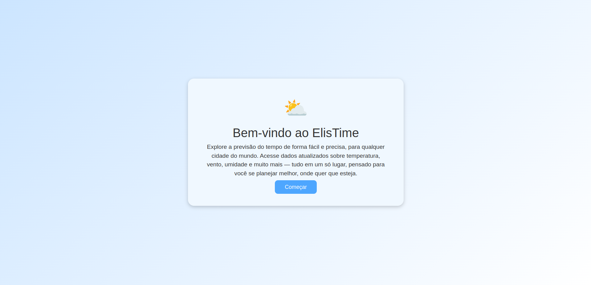
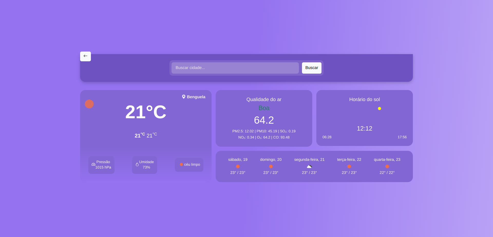
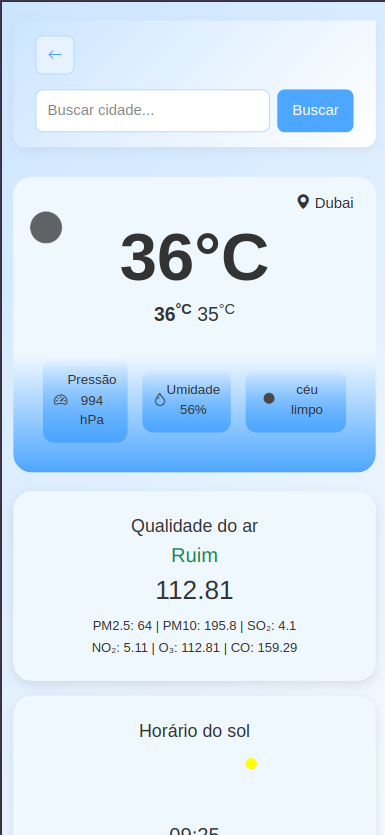

# 🌦️ ElisTime — Previsão do Tempo

Este é um projeto de previsão do tempo desenvolvido em **React**, Focado na consulta de previsões meteorológicas em tempo real, com integração a uma API externa. O projeto oferece funcionalidades como pesquisa por cidade, exibição das condições climáticas atuais, previsão estendida para 5 dias e informações detalhadas de temperatura, umidade, vento, além dos horários de nascer e pôr do sol.

## 📸 Capturas de Tela

### Tela de Boas-vindas

Veja como os usuários são recebidos ao acessar a aplicação:



---

### 🌤️ Página Principal - ElisTime

Exibe informações climáticas detalhadas para a cidade pesquisada:



---

### 📱 Versão Mobile

A aplicação também é totalmente responsiva para dispositivos móveis:

| Tela de Boas-vindas | Página Principal |
|---------------------|------------------|
|  |  |


## 📜 Licença
Este projeto está licenciado sob a licença MIT - veja o arquivo [LICENSE](./LICENSE) para mais detalhes.

## ✨ Funcionalidades

- 🔍 Consulta de previsão do tempo por cidade.
- 🌡️ Exibição de temperatura, umidade, velocidade do vento e condições climáticas.
- 🧭 Horário do nascer e pôr do sol.
- 📅 Previsão dos próximos 5 dias.
- 📱 Interface moderna, amigável e responsiva.

---

## 🛠️ Tecnologias Utilizadas

- **React 19**: Biblioteca JavaScript para construção de interfaces modernas.
- **React Router DOM 7**: Para navegação entre páginas de forma declarativa.
- **React Query (TanStack Query)**: Gerenciamento eficiente de requisições assíncronas e cache.
- **Axios**: Para realizar requisições HTTP à API de clima.
- **Bootstrap 5**: Framework CSS para layout responsivo.
- **Bootstrap Icons**: Ícones SVG integrados ao Bootstrap.
- **Sass**: Pré-processador CSS para estilos mais organizados e reutilizáveis.


---

## ✅ Pré-requisitos

Antes de começar, certifique-se de ter as seguintes ferramentas instaladas:

- [Node.js](https://nodejs.org/) (v14 ou superior)
- [npm](https://www.npmjs.com/) ou [yarn](https://yarnpkg.com/)
- Um editor de código como o [Visual Studio Code](https://code.visualstudio.com/)

Você também precisará de uma **chave de API** do [OpenWeatherMap](https://openweathermap.org/api) para obter os dados meteorológicos.

Crie uma conta, Depois de logado, clique no seu nome de usuário de seguida em My API Keys para obter a sua chave da API.

---

## ⚙️ Configuração do Projeto

1. Clone este repositório:

   ```bash
   git clone https://github.com/Eliseubartolomeu/previsao-tempo.git
  ```

2. Acesse o diretório do projeto:
   ```bash
   cd previsao-tempo
   ```

3. Instale as dependências:
   ```bash
   npm install
   # ou
   yarn install
   ```

4. Você vai precisar de um arquivo `.env` na raíz do projecto irás encontrar um arquivo chamado `.env-example` renomeio-o para `.env` e adicione sua chave de API no valor da váriavel:
   ```
   VITE_OPENWEATHER_API_KEY=escrevaAquisuaChavedeAPI
   ```

## Executando o Projeto

Para iniciar o servidor de desenvolvimento, execute:

```bash
npm run
# ou
yarn start
```

O aplicativo estará disponível em [http://localhost:5173/](http://localhost:5173/).

## Contribuindo

Contribuições são bem-vindas! Siga os passos abaixo para contribuir:

1. Faça um fork do projeto. 
  
2. Crie uma branch para sua feature ou correção:
   ```bash
   git checkout -b minha-feature
   ```
3. Faça commit das suas alterações:
   ```bash
   git commit -m "Descrição da minha feature"
   ```
4. Envie para o repositório remoto:
   ```bash
   git push origin minha-feature
   ```
5. Abra um Pull Request.


## Considerações

Se o projecto for significar alguma coisa deixa um star ⭐ no repositório

Estamos juntos...

